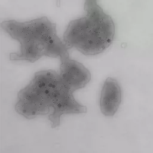

## Body

Synthetic dataset for metal surface defects classification

Only dataset available
Total 15k images, labeled with tags
Divided into 5 categories: 'normal', 'scratch', 'crack', 'rust', 'hole'

This dataset is suitable for:
Industrial quality inspection automation - Training AI to detect metal surface defects
Computer vision research - Image classification, defect detection algorithms
Manufacturing quality control - Simulating and identifying product defects on the production line
Deep learning teaching - As a standard dataset for classification tasks

Electronic virtual products are not returnable.

## Images

Here is a pay link on Stripe ( https://buy.stripe.com/3cs8yP7sY87d0vu9AB ). Please contact me lonlonago@foxmail.com after funding $89, and I will send you a complete data files , thank you!

